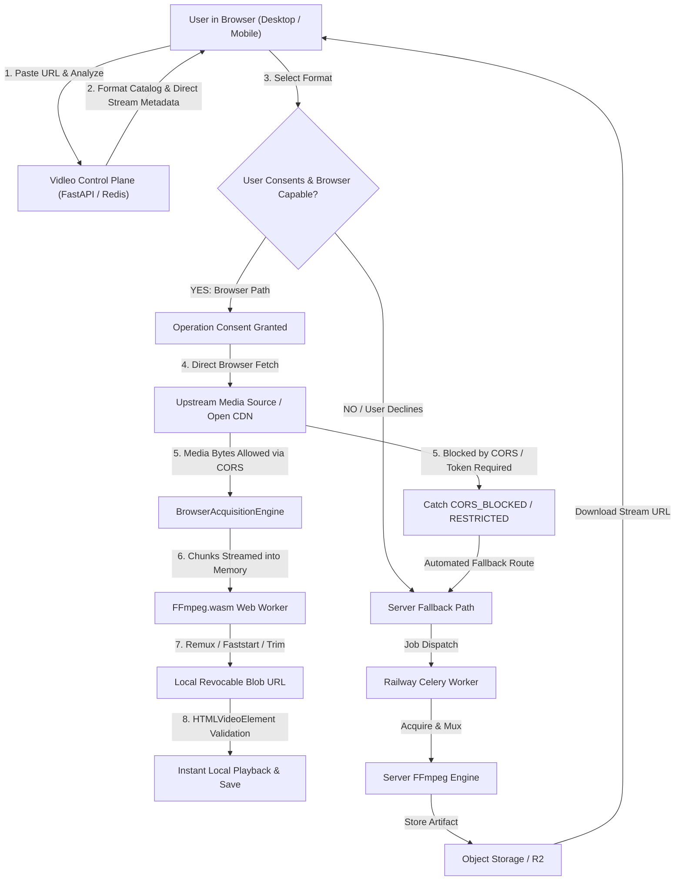
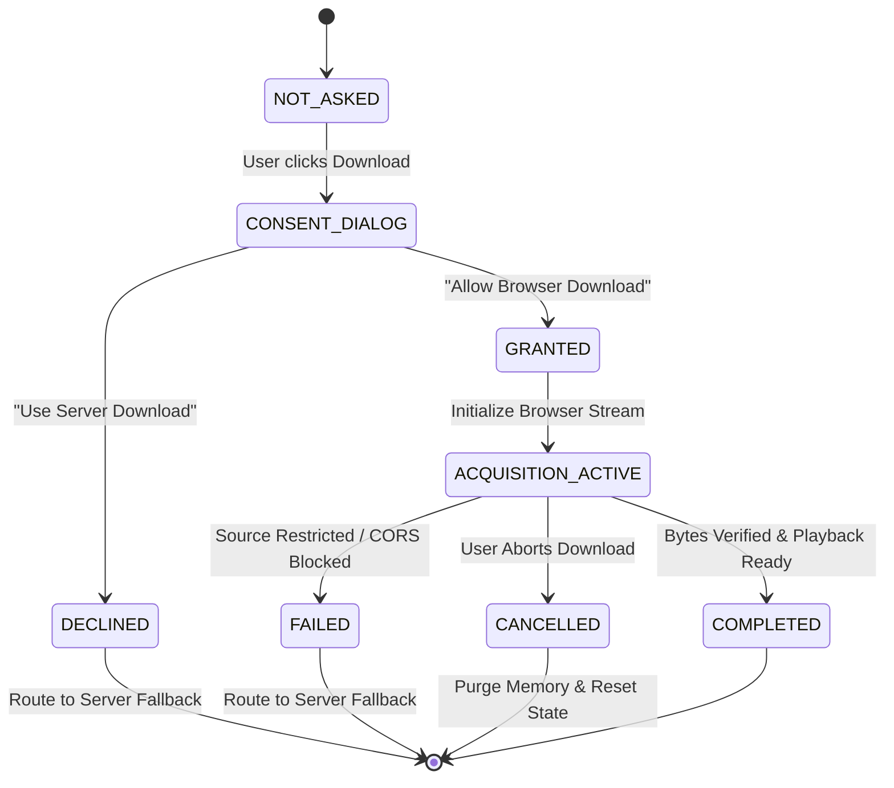

# Vidleo / NEXUS — Browser-First Media Acquisition Architecture

## 1. Executive Overview

Vidleo implements a **Browser-First Media Acquisition Architecture** designed to maximize user privacy, offload heavy compute and media egress from central infrastructure, and leverage modern browser capabilities (WebAssembly, Web Workers, Streams, Range requests).

### Core Architectural Laws
1. **Explicit User Consent**: Before browser-side media acquisition begins, the user is presented with clear, scoped consent.
2. **Client-First Network Interface**: The browser makes direct media requests using its native network stack. No raw user IPs are collected, stored, or transmitted.
3. **Zero Media Byte Transit**: For verified browser downloads, media bytes flow directly from the upstream media source into user device memory. Vidleo's backend serves strictly as a **Control Plane** (metadata, routing, authorization, job tracking).
4. **Strict Data-Path Guarantee**: An operation is certified as `BROWSER_NETWORK` only when actual media bytes are received and parsed by browser JavaScript.
5. **No Security Bypasses**: Vidleo strictly adheres to web platform security rules. It **never** circumvents CORS, defeats BotGuard/anti-bot systems, spoofs browser headers, or forges tokens. If a source blocks direct browser access (e.g. YouTube cross-origin streams), the system cleanly classifies the status and transitions to authorized server fallback.

---

## 2. System Architecture & Dual-Path Topology



---

## 3. User Consent State Machine

Consent is strictly scoped to the active download operation, revocable, and never persistent or bundled.



### Consent UX Dialog Copy
> **Browser-Side Download (NEXUS Engine)**  
> *"Vidleo can attempt to retrieve this media directly in your browser. This means your browser will make the media request using your current network connection. Media processing will happen locally on your device.*  
> *Allow browser download?"*  
> **Buttons**: `[ Allow Browser Download ]` `[ Use Server Download ]`  
> *Privacy Guarantee: Zero media bytes are transferred through Vidleo servers when browser acquisition succeeds.*

---

## 4. Browser Acquisition Engine (`BrowserAcquisitionEngine`)

Located in [`frontend/src/lib/browser-acquisition/engine.ts`](file:///home/system/Desktop/Vidleo_intergrated/frontend/src/lib/browser-acquisition/engine.ts):

### Public API
- `canAcquire(sourceUrl: string, expectedBytes?: number)`: Validates URL safety, protocol, resource budgets, domain cache, and browser capabilities.
- `acquire(options: BrowserAcquireOptions)`: Executes direct stream fetch, chunked stream accumulation, container signature verification, optional FFmpeg.wasm processing, and playback verification.
- `cancel()`: Immediately aborts active network requests via `AbortController` and flushes memory.
- `getProgress()`: Real-time progress percentage, downloaded bytes, throughput speed, and stage.
- `getDiagnostics()`: Detailed telemetry metrics for observability.

### Strict Data-Path Classification
| Status | Definition | Next Action |
|---|---|---|
| `SUPPORTED` | Direct browser fetch allowed; bytes received and verified | Stream to FFmpeg.wasm |
| `CORS_BLOCKED` | Upstream domain blocks cross-origin fetch (`No Access-Control-Allow-Origin`) | Fall back to Server |
| `AUTH_REQUIRED` | Upstream returns HTTP 401/403 or signature expired | Fall back to Server |
| `SOURCE_RESTRICTED`| Upstream rate limit or platform challenge encountered | Fall back to Server |
| `UNSUPPORTED` | File exceeds safe client budget or device memory limit | Fall back to Server |
| `BLOCKED` | URL points to private IP, localhost, or invalid protocol | Hard Reject (SSRF Protection) |
| `ABORTED` | User explicitly clicked Cancel | Clean memory and stop |

---

## 5. Client Resource Budget & Safety Boundaries

To prevent mobile browser tab crashes and memory exhaustion, conservative budgets are enforced prior to allocation:

| Metric | Desktop Environment | Mobile Environment | Enforced Action if Exceeded |
|---|---|---|---|
| **Max File Size** | 450 MB | 150 MB | Route to Server Fallback |
| **Max Heap Allocation** | 1024 MB | 512 MB | Route to Server Fallback |
| **Max Processing Time** | 180 seconds | 120 seconds | Abort & Fallback |
| **Max Concurrent Jobs** | 1 active job | 1 active job | Queue or Block |

---

## 6. Upstream Platform Behavior & YouTube Reality

### Separation of Verification Statuses
- **`BROWSER_RENDERING`**: **VERIFIED**  
  Browser receives media bytes (via open CDN or local source) $\rightarrow$ FFmpeg.wasm remuxes and packages $\rightarrow$ Valid MP4 output $\rightarrow$ HTMLVideoElement plays successfully.
- **`BROWSER_ACQUISITION` (YouTube)**: **NOT VERIFIED**  
  YouTube stream endpoints (`*.googlevideo.com`) do not include permissive CORS headers (`Access-Control-Allow-Origin: *`) for browser JavaScript fetch requests. Web browsers strictly block direct cross-origin fetches with `TypeError: Failed to fetch` (`CORS_BLOCKED`).
- **`SERVER_FALLBACK`**: **VERIFIED**  
  When browser acquisition is blocked by CORS, Vidleo seamlessly transitions the job to the Railway FastAPI/Celery backend pipeline.

---

## 7. Evidence Table

| Capability | Status | Test | Environment | Result | Evidence | Limitation / Boundary |
|---|---|---|---|---|---|---|
| **Browser FFmpeg Rendering** | **VERIFIED** | Headless Chromium Suite 1 | Debian Linux Container (Chromium 153) | **PASS** | 122,762 bytes remuxed, container atoms verified, HTMLVideoElement played | Single-threaded WebAssembly; requires valid input stream bytes |
| **Browser Acquisition (Open Source)** | **VERIFIED** | Real Fixture Acquisition | Headless Chromium | **PASS** | Acquired via `ReadableStream`, `acquisitionSource: BROWSER_NETWORK`, zero backend transit | Dependent on upstream CORS permission |
| **YouTube Browser Acquisition** | **NOT VERIFIED** | Direct `googlevideo.com` Probe | Headless Chromium Suite 2 | **BLOCKED (CORS)** | Caught `CORS_BLOCKED`, `acquisitionSource: UNKNOWN`; no bypass attempted | Blocked by YouTube edge cross-origin policy |
| **Consent State Machine** | **VERIFIED** | Suite 3 Unit & Integration | Headless Chromium | **PASS** | Transitioned `NOT_ASKED` $\rightarrow$ `CONSENT_DIALOG` $\rightarrow$ `DECLINED` / `GRANTED` | Scoped to current download operation |
| **Client Resource Budget** | **VERIFIED** | Suite 4 (800MB Input) | Headless Chromium | **PASS** | Rejected 800MB stream with `UNSUPPORTED`, routed to server | 450MB Desktop / 150MB Mobile ceiling |
| **SSRF & Address Isolation** | **VERIFIED** | Suite 5 (Localhost / 127.0.0.1) | Headless Chromium | **PASS** | Blocked private IPs and non-http schemes | Strict whitelist on external http/https |
| **Server Fallback Pipeline** | **VERIFIED** | Live Production Endpoint Probe | Railway Backend (`/api/extract`, `/api/download-job`) | **PASS** | Structured fallback response `UPSTREAM_RATE_LIMITED` | Subject to upstream datacenter IP reputation |

---

## 8. Operational Runbook & Feature Flags

### Feature Flags & Kill Switch
Configurable via `FeatureFlagManager.setFlags(...)` or `localStorage.vidleo_feature_flags`:
- `browserMediaEnabled` (default `true`): Master kill switch for all browser-side operations.
- `browserYoutubeAcquisitionEnabled` (default `true`): Controls whether YouTube browser attempts are evaluated.
- `browserFfmpegEnabled` (default `true`): Enables or disables client FFmpeg.wasm processing.
- `browserServerFallbackEnabled` (default `true`): Ensures server fallback is always engaged when browser fails.

### Production Verification Commands
1. **Frontend Production Check**:
   ```bash
   curl -I https://frontend-kaveri-d.vercel.app/
   ```
2. **Backend Health & Celery Probe**:
   ```bash
   curl -s https://backend-production-2ff30.up.railway.app/api/health
   ```
3. **Automated Browser Acquisition Test Suite**:
   ```bash
   docker run --rm -v $(pwd)/frontend:/app -w /app openshorts-main-renderer:latest node scripts/run-acquisition-e2e.mjs
   ```
