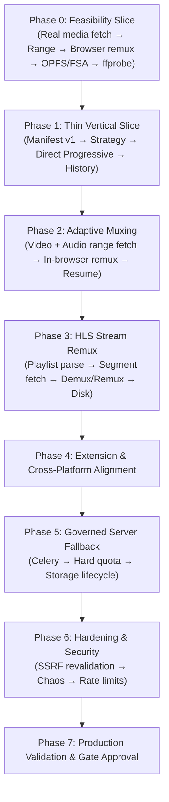

# NEXUS / Vidleo Implementation Audit

**Audit Date:** 2026-09-25  
**Codebase:** Vidleo Integrated (`frontend/` + `backend/`)  
**Target Architecture:** NEXUS Client-First Media Download Architecture (Frozen)  

---

## 1. Executive Summary

This audit evaluates the existing Vidleo repository against the frozen **NEXUS Client-First Media Download Architecture**.

The fundamental architectural principle of NEXUS is:
> **Media moves from Source &rarr; User Device whenever technically possible.**  
> The backend acts primarily as a **Control Plane** (Authenticate &rarr; Validate &rarr; Resolve &rarr; Manifest &rarr; Strategy &rarr; Ticket &rarr; Track), exiting the media transport path. Server fallback (via Celery/FFmpeg) is strictly reserved for client-unsupported edge cases subject to hard quota and cost controls.

### Overall Assessment
- **Existing Strengths:** The repository already possesses a mature control plane foundation: high-performance metadata probing with `yt-dlp` and `curl-cffi` Chrome impersonation, cookie vaulting, Redis job caching, Supabase database schemas for jobs and history, and a modern Next.js 14 UI.
- **Architectural Gaps:** The current download pipeline operates in **Server-First** mode—`POST /api/download-job` triggers a server-side `yt-dlp` download to `.runtime/downloads/` on the server disk, which is then served via `GET /api/download/file/{job_id}`.
- **Migration Path:** Preserve the existing extraction, auth, admin, and job tracking systems. Transform the download path into a versioned **MediaManifest v1**, a deterministic **StrategyEngine**, and a modular **Browser MediaEngine** (Range fetcher, MP4/WebM streaming muxer, FSA/OPFS sink) with controlled server fallback.

---

## 2. Current Architecture Inventory

### 2.1 Backend (`backend/`)
- **Runtime & Framework:** FastAPI 0.141.1, Python 3.14/3.11, Uvicorn.
- **Extraction Layer (`extractor_service.py`):**
  - Uses `yt-dlp` (2026.08.19) with `curl-cffi` for browser impersonation (Chrome-133, etc.).
  - PO token sidecar integration (`YOUTUBE_PO_TOKEN_SIDECAR_URL`).
  - Cookie vault support (`acquire_vault_cookie_file`, `cookie_vault.py`).
  - Multi-tier probe caching: L1 in-memory LRU (`collections.OrderedDict`) + L2 Redis cache (`nexus:probe:*`, TTL 3600s).
- **Format Parser (`format_parser.py`):**
  - Parses video, audio, and combined stream formats.
  - Extracts width, height, resolution label, approximate filesize, duration, containers (`mp4`, `webm`, `m4a`, `mp3`).
  - Contains platform-specific limit annotations (Telegram 50MB, Discord 25MB).
- **Job Orchestration & Storage (`job_store.py`, `job_runner.py`):**
  - Fast in-memory state dictionary (`JOB_RUNTIME_STATE`) synced to Redis (`nexus:job:state:{id}`) and Supabase `public.jobs` / `public.job_events`.
  - Claim/deduplication lock to prevent duplicate concurrent downloads for identical URLs/formats.
  - Cancellation flag tracking (`nexus:job:cancel:{id}`).
- **Server Download Handler (`download_handler.py`):**
  - Executes server-side `yt-dlp` CLI subprocess to download media into local `.runtime/downloads/`.
  - Regex-based progress parser (`progress_tracker.py`) updating percent, speed, and ETA.
  - Serves files directly via `FileResponse` on `/api/download/file/{job_id}`.
- **Async Workers & Queue (`celery_app.py`, `tasks.py`):**
  - Celery 5.4.0 configured with Redis broker (`redis://127.0.0.1:6379/0`).
  - Queues: `meta` (metadata probes), `render` (heavy FFmpeg tasks), `syndicate` (webhooks/uploads), `maintenance_worker` (rollups/alerts).
  - Toggled via `NEXUS_USE_CELERY` env flag (defaults to local async in dev).
- **Authentication & Security (`auth.py`, `security.py`, `supabase_client.py`):**
  - Supabase JWT token verification via `SUPABASE_JWT_SECRET` and `SUPABASE_URL`.
  - Role-based access control (`public.user_roles`, `public.profiles`).
  - Unkey API key verification (`verify_unkey_token`).
  - Localhost and `X-Nexus-Admin` secret exemptions.
- **Admin Control Plane (`owner_router.py`):**
  - Complete owner/admin endpoints for metrics, proxy health, user management, and configuration.

### 2.2 Frontend (`frontend/`)
- **Framework & Tooling:** Next.js 14.2.15 (App Router), React 18/19, Tailwind CSS, TypeScript 5.6.3.
- **Downloader Service (`src/services/downloader/downloaderService.ts`):**
  - Fully wired to real backend endpoints (`/api/extract`, `/api/download-job`, `/api/progress/{job_id}`, `/api/download/file/{job_id}`).
  - Zero mock data, zero synthetic speed/ETA generation.
- **UI Components (`src/components/downloader/`):**
  - `UrlDownloader.tsx`: Input URL, analyze trigger, stage management (`idle` &rarr; `analyzing` &rarr; `detected` &rarr; `downloading` &rarr; `ready`).
  - `VideoDetectedCard.tsx`: Thumbnail, metadata header, quality selection, format switch.
  - `QualitySelector.tsx`: Quality options list with resolution and size indicators.
  - `AnalysisState.tsx`: Progress feedback during extraction.
  - `DownloadReadyState.tsx`: Progress bar, speed/ETA readout, and final download trigger.
- **Admin Portal (`src/app/admin/`):**
  - `/admin/login`, `/admin/dashboard`, `/admin/downloads`, `/admin/users`, `/admin/jobs`.

### 2.3 Database & Schemas (`backend/sql/`)
- 28 migrations covering:
  - `public.jobs`: ID, user_id, provider, status, progress_percent, failure_reason, created_at, updated_at.
  - `public.job_events`: Granular event audit trail per job.
  - `public.media_history`: Completed downloads history with format, delivery_mode, filesize.
  - `public.subscriptions`, `public.user_credit_grants`, `public.audit_logs`, `public.api_request_logs`.

---

## 3. Reusable Components

The following existing components will be directly reused without destructive changes:
1. **`backend/extractor_service.py`:** Keep yt-dlp probing, Chrome impersonation, cookie vaulting, and caching. We will extend the extract response to generate the `MediaManifest`.
2. **`backend/format_parser.py`:** Reuse format categorization, stream bitrate calculations, and container detection.
3. **`backend/job_store.py`:** Reuse Redis state caching, event recording, deduplication, and cancellation tracking.
4. **`backend/celery_app.py` & `backend/tasks.py`:** Preserve as the backbone of the `SERVER_FALLBACK` strategy.
5. **`backend/auth.py` & `backend/security.py`:** Keep existing token validation, user context injection, and entitlement resolution.
6. **`frontend/src/components/downloader/*`:** Preserve all UI components and styling. The UI contract with `downloaderService` remains clean and backwards-compatible.

---

## 4. Conflicting & Dangerous Components

1. **Default Server-Side Download (`backend/download_handler.py`):**
   - *Conflict:* Directly downloads full media files to the backend server disk. For 4K streams or multi-gigabyte media, this saturates server network bandwidth, exhausts disk space, and incurs unnecessary compute overhead.
   - *Resolution:* Move server-side download to the `SERVER_FALLBACK` strategy handler. Primary media movement must occur client-side.
2. **Missing Manifest & Capability Negotiation:**
   - *Conflict:* Frontend receives flat format lists and blindly passes `format_id` to the backend. The frontend cannot currently decide if direct fetch or client-side remux is feasible.
   - *Resolution:* Expose versioned `MediaManifest` v1 containing media stream URLs, headers, range capabilities, and expiration timestamps.
3. **Missing SSRF Revalidation on Redirects:**
   - *Danger:* Any server-side fetch without strict destination IP/subnet revalidation across HTTP redirects poses an SSRF vulnerability to internal VPC/cloud metadata services (e.g., `169.254.169.254`).
   - *Resolution:* Implement `OutboundFetchPolicy` with per-hop IP and host revalidation.
4. **In-Memory Buffer Allocation Risk:**
   - *Danger:* In-browser downloading of large media files (1GB+) using `response.arrayBuffer()` will crash browser tabs due to heap exhaustion.
   - *Resolution:* Implement streaming chunk processing with direct piping into File System Access API or Origin Private File System (OPFS).

---

## 5. Exact Gap Analysis Against Frozen NEXUS Architecture

| NEXUS Requirement | Current State | Status | Required Action |
| :--- | :--- | :--- | :--- |
| **Control Plane Exits Media Path** | Backend downloads every byte to server disk | Gap | Introduce `DIRECT_PROGRESSIVE`, `DIRECT_RANGE`, and `BROWSER_ADAPTIVE_MUX` strategies. |
| **MediaManifest v1 Contract** | Unversioned yt-dlp format list | Gap | Implement `manifest_version: "1"` schema with stream details, headers, range flags, expiration. |
| **Deterministic Strategy Engine** | Hardcoded server download | Gap | Implement `StrategyEngine` (manifest + browser caps + policy &rarr; single strategy). |
| **Short-Lived Signed Tickets** | Static token / HMAC download URL | Gap | Implement versioned `SignedTicket` (claims: `jti`, `user_id`, `job_id`, `allowed_host`, `max_bytes`, expiry). |
| **Range-Aware Browser Fetch Engine** | Browser uses native `<a>` download or server proxy | Gap | Build modular Range Fetcher supporting 206 partial content, chunking, retry with jitter. |
| **In-Browser Demux & Streaming Mux** | None (FFmpeg executed on server) | Gap | Implement client-side demux and remux (MP4Box / WebM muxer) with bounded memory. |
| **FSA / OPFS Disk Storage** | Memory blob creation / standard browser download | Gap | Implement `FileSystemAccessSink` and `OPFSSink` for streaming disk writes. |
| **Controlled Server Fallback** | Default path | Preserved & Adapted | Restrict server download to fallback cases governed by user tier and resource limits. |
| **SSRF Safe Outbound Policy** | Basic domain check | Gap | Implement `OutboundFetchPolicy` with DNS resolution, private IP blocking, redirect revalidation. |
| **Authoritative PostgreSQL Quota** | In-memory / credit grants | Partial | Add atomic quota reservation (`RESERVED` &rarr; `COMMITTED` / `RELEASED`) in Postgres. |

---

## 6. Exact File-by-File Migration Plan

### 6.1 Backend Additions & Adaptations
1. **`backend/manifest_schema.py` [NEW]:**
   - Pydantic models for `MediaManifest` v1 (`StreamInfo`, `AccessRequirements`, `MediaCapabilities`, `SourcePolicy`).
2. **`backend/strategy_engine.py` [NEW]:**
   - Pure, deterministic strategy evaluator implementing selection logic:
     - `DIRECT_PROGRESSIVE` (direct URL with CORS, progressive MP4/WebM)
     - `DIRECT_RANGE` (single stream requiring range support)
     - `BROWSER_ADAPTIVE_MUX` (separate video + audio streams, client capable of demux/mux)
     - `BROWSER_HLS` (HLS playlist with direct segment access)
     - `SIGNED_WORKER_RANGE` (direct CORS blocked, worker relay permitted)
     - `SERVER_FALLBACK` (client incapable, DRM, or complex transcoding required)
     - `UNSUPPORTED` (infeasible operation)
3. **`backend/ticket_service.py` [NEW]:**
   - Issue and verify short-lived HMAC-signed tickets (`jti`, `job_id`, `allowed_host`, byte budget, expiry).
4. **`backend/outbound_policy.py` [NEW]:**
   - SSRF protection engine: validate scheme, resolve DNS, deny private IP ranges (`10.0.0.0/8`, `172.16.0.0/12`, `192.168.0.0/16`, `127.0.0.0/8`, `169.254.169.254`), revalidate on every redirect.
5. **`backend/extractor_service.py` [MODIFY]:**
   - Retain raw format metadata (direct URLs, HTTP headers, cookies) to construct the versioned manifest.
6. **`backend/main.py` [MODIFY]:**
   - Add `GET /api/downloads/{job_id}/manifest` endpoint.
   - Add `POST /api/downloads/{job_id}/ticket` endpoint.
   - Update `POST /api/extract` to include the manifest v1 payload while preserving backwards compatibility.
7. **`backend/download_handler.py` [MODIFY]:**
   - Rename primary download routine to serve strictly as `run_server_fallback_download`.

### 6.2 Frontend Additions & Adaptations
1. **`frontend/src/packages/media-engine/` [NEW]:**
   - Modular TypeScript package for client-first media processing:
     - `capability.ts`: Detect FSA API, OPFS, MediaSource, WebCodecs, WebAssembly.
     - `strategy.ts`: Client-side strategy evaluation mirror.
     - `fetcher.ts`: Range-aware chunked HTTP fetcher with retry, exponential backoff, jitter, and cancellation.
     - `muxer/`: In-browser streaming remuxer (MP4 and WebM packet processing).
     - `sink/`: `FileSystemAccessSink` (streaming to user-selected file) and `OPFSSink` (Origin Private File System cache).
     - `recovery.ts`: Checkpoint manager for resuming interrupted downloads.
2. **`frontend/src/services/downloader/downloaderService.ts` [MODIFY]:**
   - Update `analyzeVideo` to consume `MediaManifest` v1.
   - Update `executeDownload` to route execution through `MediaEngine`:
     - If strategy is `DIRECT_PROGRESSIVE`, `DIRECT_RANGE`, or `BROWSER_ADAPTIVE_MUX`, execute in-browser.
     - If strategy is `SERVER_FALLBACK`, delegate to backend `POST /api/download-job` and poll.

---

## 7. Dependency Map & Implementation Order

---

## 8. Immediate Action: Phase 0 Feasibility Slice Plan

Before proceeding with Phase 1, we must execute the Phase 0 feasibility slice on a real media stream:
1. **Source:** Resolve a real video with separate video (H.264) and audio (AAC) streams.
2. **Range Fetch:** Fetch sample chunks via HTTP Range headers with bounded memory buffers.
3. **Muxing:** Remux into an MP4 container in the client environment without transcoding.
4. **Sink:** Stream chunks directly into disk/OPFS storage.
5. **Verification:** Inspect output file with `ffprobe` for stream integrity, duration, audio-video sync, and container conformity.
6. **Documentation:** Record exact memory, CPU, speed, and validation metrics in `docs/PHASE_0_RESULTS.md`.
