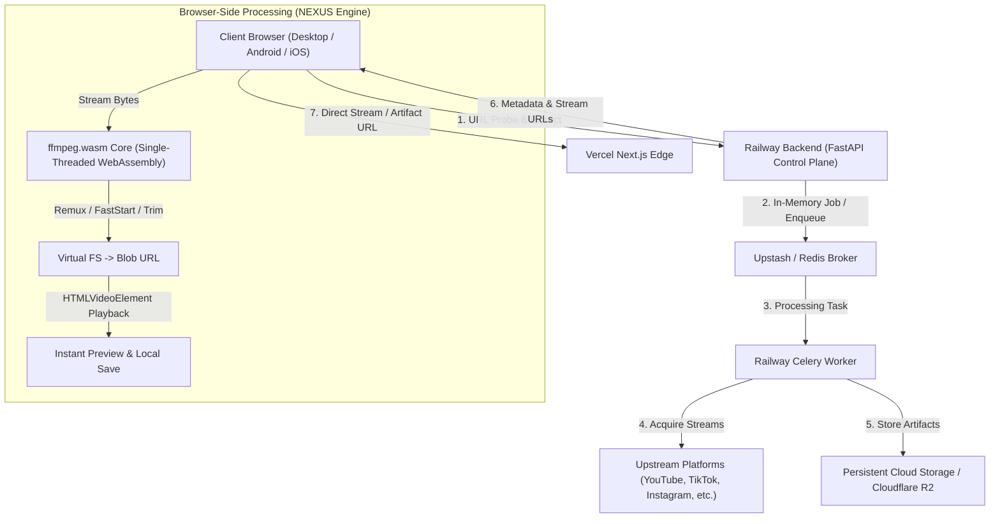

# Vidleo / NEXUS Production Media Architecture

## 1. System Topology Overview

Vidleo combines a distributed serverless control plane with client-side WebAssembly media processing to provide video acquisition, transformation, and playback.



---

## 2. Browser-Side Media Processing Architecture (ffmpeg.wasm)

Vidleo integrates `@ffmpeg/ffmpeg` and `@ffmpeg/core` to perform client-side media operations directly inside the user's browser, eliminating server compute costs and bandwidth egress for common post-processing tasks.

### Core Capabilities
- **Lossless Remuxing**: Re-packages raw elementary video/audio streams into standard MP4 containers with `-c copy -movflags +faststart` for instant web streaming.
- **Accurate Trimming**: Performs fast keyframe and timestamp-accurate trimming (`-ss <start> -to <end> -c copy`) directly in browser memory.
- **Container Conversion**: Converts audio/video containers (e.g. MKV/WebM to MP4, MP4 to MP3/M4A) client-side.
- **Zero Server Egress for Edits**: Users can inspect, trim, or remux downloaded streams without re-uploading bytes to the backend.

### Memory & Execution Safety Guardrails
- **Max Buffer Limits**:
  - Desktop Browsers: Up to 450 MB.
  - Mobile Devices (Android / iOS): Strictly capped at 150 MB to prevent mobile browser tab out-of-memory crashes.
- **Strict Virtual FS Cleanup**: Virtual filesystem files (`FS.unlink / ffmpeg.deleteFile`) are purged in `finally` blocks to prevent WebAssembly heap exhaustion.
- **Cancellation**: Full `AbortController` and `AbortSignal` support allowing the user to cancel long-running operations mid-stream.
- **Revocable URLs**: All preview object URLs are tracked and revoked (`URL.revokeObjectURL`) on unmount or re-render.

---

## 3. Rationale for Single-Threaded Isolation

### Multi-Threaded vs Single-Threaded `@ffmpeg/core`

Multi-threaded WebAssembly (`@ffmpeg/core-mt`) requires `SharedArrayBuffer`, which modern browsers only permit when the page is served with Cross-Origin Isolation headers:
```http
Cross-Origin-Opener-Policy: same-origin
Cross-Origin-Embedder-Policy: require-corp
```

### Why Multi-Threaded Breaks Production Web Apps:
1. **Third-Party Authentication**: `Cross-Origin-Opener-Policy: same-origin` breaks Google and Supabase OAuth popup flows. When a user clicks "Sign in with Google", the popup window cannot communicate its authentication result back to the opener window (`window.opener` becomes `null`), breaking login completely.
2. **Cross-Origin Media CDNs**: `Cross-Origin-Embedder-Policy: require-corp` blocks all cross-origin images, avatars, video stream chunks, and third-party media that lack `Cross-Origin-Resource-Policy: cross-origin` headers.
3. **Android Chrome Compatibility**: Android WebViews and mobile browsers have inconsistent `SharedArrayBuffer` support.

### The Vidleo Production Solution:
Vidleo utilizes **single-threaded `@ffmpeg/core`**:
- **Zero COOP/COEP Requirements**: Runs safely in standard web environments without breaking Supabase OAuth or CDN assets.
- **Web Worker Delegation**: Offloads all processing to a dedicated background Web Worker, ensuring the UI thread remains at 60 FPS without jank.
- **Same-Origin Worker Proxying**: Resolves the Web Worker script via blob URLs / same-origin routes to comply with the browser's Same-Origin Policy.

---

## 4. Upstream YouTube Extraction Strategy

### Architectural Separation: Acquisition vs Processing
> **Architectural Law**: Client-side media processing (`ffmpeg.wasm`) operates downstream on media bytes. It does **not** bypass upstream platform anti-bot measures (e.g. YouTube BotGuard, Cloudflare Turnstile, Akamai). Stream acquisition and client rendering are strictly decoupled.

### Multi-Client Spoofing Strategy
In `backend/extractor_service.py`, `yt-dlp` is configured with multi-client fallbacks:
```python
extractor_args = {
    "youtube": {
        "player_client": ["visionos", "android", "tv", "web"]
    }
}
```
- **`visionos`**: Apple Vision OS client often experiences the lowest rate of automated bot challenges.
- **`android`**: Android player client uses protobuf tokens and avoids web browser JS challenges.
- **`tv`**: YouTube on TV client bypasses web-specific BotGuard scripts.
- **`web`**: Standard fallback.

### JavaScript Runtime Integration
YouTube's n-sig challenge requires executing external JavaScript deciphering code. The backend specifies:
```python
"js_runtimes": {"node": {}}
```
With Node.js available in the container runtime, `yt-dlp` deciphers complex signature and throttling algorithms automatically.

### Datacenter Rate-Limit & BotGuard Fallback
When cloud datacenter IP ranges (e.g., Railway, AWS, GCP) are blocked by upstream YouTube anti-bot systems:
1. The backend catches `MediaExtractionError` and returns a structured JSON error:
   ```json
   {
     "code": "UPSTREAM_RATE_LIMITED",
     "provider": "youtube",
     "retryable": true,
     "browser_fallback_available": true,
     "message": "YouTube anti-bot challenge triggered on server IP. Browser fallback available."
   }
   ```
2. The frontend cleanly parses this payload and presents user-friendly remediation (retry with different client, download client-side, or use alternative formats).

---

## 5. Server-to-Browser Routing Decision Engine

Located in `frontend/src/lib/browser-media/decisionEngine.ts`, the decision engine evaluates:
1. **Operation Type**: Lossless remuxing and trimming are prioritized for the browser (`RECOMMENDED_BROWSER`). Transcoding 4K video is routed to the server (`RECOMMENDED_SERVER`).
2. **Device Hardware Capabilities**: Evaluates mobile vs desktop and WebAssembly SIMD availability.
3. **File Size**: Files > 450 MB (desktop) or > 150 MB (mobile) are designated `SERVER_ONLY`.

| Operation | Input Size | Device | Decision |
|---|---|---|---|
| Remux (`-c copy`) | < 150 MB | Any | `RECOMMENDED_BROWSER` |
| Trim (`-ss ... -t ...`) | < 150 MB | Any | `RECOMMENDED_BROWSER` |
| Remux / Trim | 150 MB - 450 MB | Desktop | `RECOMMENDED_BROWSER` |
| Remux / Trim | > 150 MB | Mobile | `RECOMMENDED_SERVER` |
| Full Video Transcode | > 50 MB | Mobile | `SERVER_ONLY` |
| Any Operation | > 450 MB | Any | `SERVER_ONLY` |

---

## 6. Operational Runbook

### Health Checks
- **Frontend Live Check**: `curl -I https://frontend-kaveri-d.vercel.app/` -> `HTTP 200`
- **Auth Redirect Validation**: `curl -s -o /dev/null -w "%{http_code} -> %{redirect_url}\n" https://frontend-kaveri-d.vercel.app/auth/callback` -> `307 -> https://frontend-kaveri-d.vercel.app/login?error=authentication_failed` (never `localhost:3000`)
- **Backend Health Check**: `curl https://backend-production-2ff30.up.railway.app/api/health` -> `{"status":"healthy",...}`

### Automated Browser Verification
To run the browser media engine automated test suite:
```bash
docker run --rm -v $(pwd)/frontend:/app -w /app openshorts-main-renderer:latest node scripts/run-browser-e2e.mjs
```
Expected output:
- Lossless remux byte validation
- Trimming byte validation
- `HTMLVideoElement` playback metadata validation
- `ffprobe` stream structure verification
